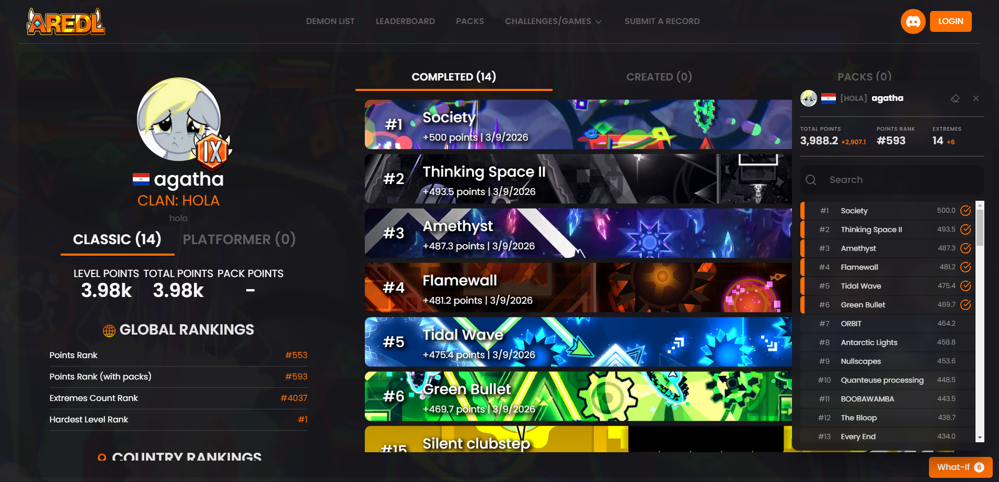

# AREDL What-If

visualize simulated records on your profile: points, packs and leaderboard rank on aredl

click an extreme and the site will update it like you beat it! (･ω･)

very useful for calculating your points and rank with levels you want to beat or records that are pending  

## what it does

- mark any level as beaten, or unbeat one you actually have
- your profile updates the level points, pack points, extremes, hardest
- all 8 ranks are recalculated, global and country
- simulated levels also show as completed on the list
- nothing is sent to aredl obv, it all stays in your browser

## install

**userscript** (easiest): if you already have tampermonkey or violentmonkey, click
[aredl-whatif.user.js](https://github.com/agatkhas/aredl-whatif/releases/latest/download/aredl-whatif.user.js) and install

**extension** (chrome / edge / brave):

1. download the zip from [releases](https://github.com/agatkhas/aredl-whatif/releases/latest)
   and unzip it
2. go to `chrome://extensions` and turn on developer mode
3. "load unpacked" and pick the folder

**firefox**: `about:debugging` > this firefox > load temporary add-on > pick `manifest.json`

## how to use

open your profile on aredl and the What-If button shows up bottom right, search a level and click
it:

- orange edge = pretending you beat it
- red edge = pretending you didnt

click again to undo, or hit the eraser to clear everything. whatever profile you open becomes
the one it simulates, so you can mess with other people's too, and each profile keeps its own set
of changes so switching around doesn't mix them up

## how it works

aredl loads its data from `api.aredl.net` in your browser, so this wraps `fetch`, edits the
response before react sees it, and tells the router to rerender.

points arent guessed bc the api already gives points per level and per pack so it's just adding
them up, ranks are the annoying part with 66k players, so instead of downloading the whole
leaderboard it binary searches it and caches every (score -> rank) pair it finds.
usually your next click is already covered by the cache and its instant. if a rank is still being figured out it
shows greyed with a `~` in front :o

## stuff to know

- the first paint of a page comes from aredl's server, so you can catch a split second of the real
  numbers before it updates
- your leaderboard row gets updated but the page isn't re-sorted
- classic list only for now

## planned

- [ ] platformer list (arepl) support (MEHH)
- [ ] re-sorting the leaderboard properly

if got an idea plz just open an [issue](https://github.com/agatkhas/aredl-whatif/issues) ( ˘ ³˘) !!

## credits

- [list-calc](https://list-calc.finite-weeb.xyz/) by FiNiTe, the original idea, this is basically
  that but inside the site!
- the aredl devs for having a public api with actual docs ^~^

---

made by agatha · [aredl](https://aredl.net/profile/user/agatkha) · discord: agatkha
